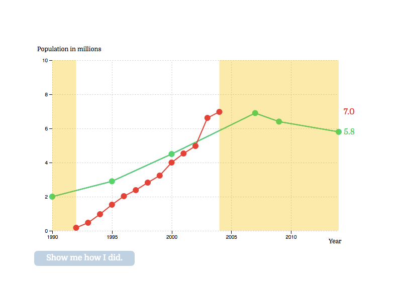

# You Guess It

You Guess It is a React widget is a inspired by NYT [You](https://www.nytimes.com/interactive/2017/01/15/us/politics/you-draw-obama-legacy.html) [Draw It](https://www.nytimes.com/interactive/2015/05/28/upshot/you-draw-it-how-family-income-affects-childrens-college-chances.html) pieces.

It is built using JavaScript, D3, and React.

Check out the [ demo here](https://calebomusic.github.io/you_guess_it/)!



## Installation

NPM Package coming soon! For now, download repo here. Then run `npm install`. Don't forget to include the D3 script tag:

```html
<script src="https://d3js.org/d3.v4.js"></script>
```

## Usage

The GraphWidget component has five properties `graphId`, `options`, `question`, `beforeGuess`, and `answer`:

```javascript
<GraphWidget graphId='greatGraph'
             options={greatGraphOptions}
             question={GreatQuestion}
             beforeGuess={BeforeGuessGreat}
             answer={GreatAnswer}/>
```

`question`, `beforeGuess`, and `answer` are optional React components respectively. `question` is shown before the graph, `beforeGuess` is disabled until the guess is complete, while answer is revealed when `beforeGuess` is enabled and clicked.

The options property lets you customize your widget. Here is an example options object from one of the demos:

```javascript
const mexicoAndOtherOptions = {
  xAxisText: 'Year',
  yAxisText: 'Population in millions',
  yMin: 0,
  yMax: 10,
  xKey: 'year',
  yKey: 'population',
  xMin: 1990,
  xMax: 2014,
  xAxisLabelFormat: 'd',
  yAxisLabelFormat: '',
  xTicks: 6,
  yTicks: 5,
  guessDist: 2,
  data: otherImmigrationData,
  otherData: [ mexicanImmigrationData ]
};
```

The total number of potential keys in the options object are:

```javascript
data,
guessDist,
height,
margin,
otherData,
radius,
width,
xAxisLabelFormat,
xAxisText,
xKey,
xMax,
xMin,
xTicks,
yAxisLabelFormat,
yAxisText,
yKey,
yMax,
yMin,
yTicks
```

Important notes about using these:
- `guessDist` specifies the distance the guess line will have along the x axis. By default, the guess line's x values will be set to the x values of the data.
- `margin` is an object of the format:
```javascript
{ top: 15, right: 20, bottom: 50, left: 70 }
```
- The axesLabelFormat must follow valid D3 text format attributes (".0%" for percent, "d"  for date).
- The `xKey` and the `yKey` must be the same as the the keys in the data object. For example, in the demo, the data object:
```javascript
const mexicanImmigrationData = [
  { year: 1990, population: 2.0 },
  { year: 1995, population: 2.9 },
  ...
];
```
  Has the `yKey` of `population` and the `xKey` of `year`.
- `data` is an array of objects, as above.
- You can optionally enter `otherData` that will be displayed immediately on the render. This will be in the format of an array of data objects (array of arrays of objects)
- `xMin` and `xMax`, `yMin` and `yMax` will be set to the min and max's of `data` by default.
- `xTicks` and `yTicks` specify the amount of ticks on the grid.
- Label your axis with `yAxisText` and `xAxisText`.
- Get in touch if you'd like to see additional options!
